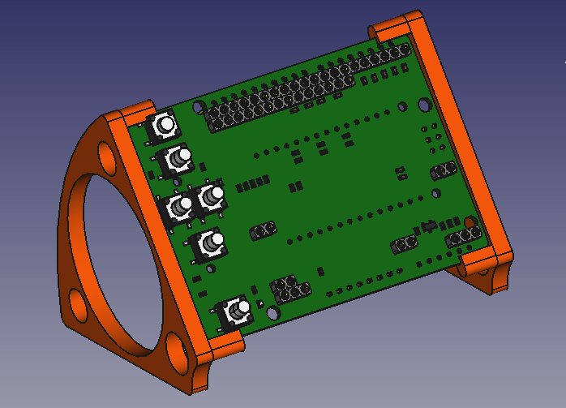

# ArduHMIShield
ArduHMIShield with EA DOGM graphic display and joystick compatible to Arduino Uno

### Holder

The holder is constructed using FreeCAD. It is 3D-printable. The files are in the folder `production-data`

## PCB

### Top

### Bottom

### Order options

The pcb is available at Aisler: https://aisler.net/p/FNAGFCPP

## License

This hardware is licensed under the CERN OHL v. 1.2
